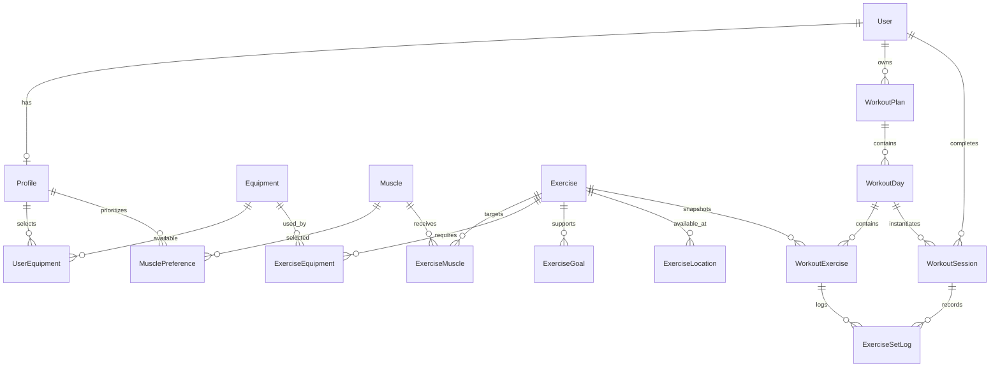

# Gym Trainer

Gym Trainer is a responsive fitness web application that builds practical workout programs from a curated exercise database using deterministic rules, equipment constraints, muscle priorities, and session limits.

Workout programs are generated using a deterministic rule-based algorithm, not AI.

> This repository page may contain the project as a ZIP archive. Extract the archive before running the application. All source code and technical documentation are included inside it.

## Overview

Many people want a workout program that fits their actual equipment, schedule, experience, and training priorities without manually assembling a routine from hundreds of exercises. Gym Trainer turns a short onboarding flow into a structured weekly program and then supports workout logging and progress tracking.

The core engineering feature is the workout generator. It filters invalid exercises first, scores only eligible exercises, selects an appropriate weekly split, assembles each session, estimates session duration, validates the final plan, and produces a human-readable reason for every selected exercise.

Version 1.3 adds priority-based body-map color intensity, 1-7 training days, and automatic embedded YouTube technique-video resolution across the full exercise library while keeping the same visual identity.

## Features

- Home and gym training modes
- Equipment-aware hard filtering
- Multi-step onboarding
- Interactive SVG body map
- Low, medium, and high muscle priorities with progressively darker body-map colors
- Deterministic rule-based workout generation
- Frequency-aware workout splits for 1-7 days per week
- Duration-aware exercise selection
- 134 curated exercises
- Exercise search and filters
- Embedded YouTube technique demonstrations
- Step-by-step exercise instructions and technique cues
- Per-exercise selection explanations
- Workout set logging
- Previous-performance display
- Double-progression recommendations
- Progress metrics and exercise-history chart
- Light, dark, and system appearance modes
- Responsive desktop and mobile navigation
- PostgreSQL and Prisma data model plus seed pipeline
- Generator, coverage, and progression tests

## Product Flow

```text
Welcome
  -> Goal
  -> Training Location
  -> Equipment
  -> Experience
  -> Muscle Map
  -> Muscle Priorities
  -> Training Frequency
  -> Session Length
  -> Review
  -> Build Program
  -> My Program
  -> Start Workout
  -> Log Sets
  -> Finish Workout
  -> Progress
```

## How the Generator Works

```text
Preferences
  -> Validate Preferences
  -> Resolve Available Equipment
  -> Choose Weekly Split
  -> Build Day Muscle Targets
  -> Filter Eligible Exercises
  -> Score Eligible Exercises
  -> Select Exercises
  -> Apply Sets, Reps, and Rest Rules
  -> Estimate Duration
  -> Trim Lower-Priority Work When Needed
  -> Validate Program
  -> Workout Plan
```

Hard constraints are applied before scoring. An exercise cannot be selected when any required piece of equipment is unavailable. Scoring never overrides that rule.

The generator is deterministic. The same profile, exercise database, and generator version produce the same plan. A small deterministic day-variation factor prevents repeated full-body days from being identical while preserving reproducibility.

The generator is implemented as a separate domain layer so its rules can be inspected and tested independently from the UI.

## Architecture

```text
Browser UI
  |
  +-- Onboarding state
  +-- Local MVP persistence
  +-- Program / workout / progress screens
  |
Next.js server
  |
  +-- Zod profile validation
  +-- Workout generation API
  |
Domain layer
  |
  +-- Equipment resolver
  +-- Split selector
  +-- Exercise filter
  +-- Exercise scorer
  +-- Duration estimator
  +-- Program validator
  +-- Progression rules
  |
Data layer
  |
  +-- Curated TypeScript exercise dataset
  +-- Prisma schema
  +-- PostgreSQL
  +-- Prisma seed
```

The workout generator is separated from React components and can be unit-tested independently. The browser MVP stores the current profile, generated plan, workout sessions, and appearance preference locally so the complete core flow can run without authentication. The repository also contains the normalized PostgreSQL/Prisma schema and seed pipeline intended for persistent user accounts.

The full technical documentation is included inside the project archive in the `docs` folder.

## Data Model



The seed uses stable muscle/equipment codes and exercise slugs rather than database-generated numeric IDs for relationships.

## Tech Stack

- Next.js 16
- React 19
- TypeScript
- Tailwind CSS 4
- PostgreSQL
- Prisma 7
- Recharts
- Vitest
- Custom SVG body map
- Embedded YouTube technique videos across the exercise library
- Automatic video matching from public exercise-video indexes
- Direct YouTube search backup if an external source is temporarily unavailable

## Project Structure

```text
src/
  app/
    api/
    dashboard/
    exercises/
    onboarding/
    program/
    progress/
    settings/
    workout/
  components/
    body-map/
    exercises/
    onboarding/
    program/
    progress/
    settings/
    ui/
    workout/
  config/
  data/
  lib/
    db/
    progression/
    workout-generator/
  types/
prisma/
  schema.prisma
  seed.ts
tests/
  generator/
  progression/
docs/
```

## Screens and Routes

| Route | Purpose |
| --- | --- |
| `/` | Product landing page |
| `/onboarding` | Workout preference wizard and program generation |
| `/dashboard` | Next workout and weekly summary |
| `/program` | Generated weekly program and exercise explanations |
| `/workout?day=0` | Mobile-friendly set logging session |
| `/exercises` | Searchable and filterable exercise library |
| `/progress` | Training metrics and exercise progression chart |
| `/settings` | Appearance and training preferences |
| `/api/generate` | Validated server-side workout generation |
| `/api/exercise-video` | Resolves the best available YouTube demonstration for an exercise |
| `/api/health` | Lightweight application health metadata |

## Local Setup

### Requirements

- Node.js 22 or newer
- npm
- Docker Desktop or another PostgreSQL installation if you want to use the Prisma database layer

### 1. Extract the project

Extract the ZIP archive and open the `gym-trainer` folder in Visual Studio, VS Code, or a terminal.

### 2. Install dependencies

On Windows PowerShell:

```powershell
npm.cmd install
```

On Command Prompt, macOS, or Linux:

```bash
npm install
```

### 3. Configure environment variables

```bash
cp .env.example .env
```

The default `.env.example` matches the included Docker PostgreSQL service.

### 4. Start PostgreSQL

```bash
docker compose up -d
```

### 5. Generate the Prisma client

```bash
npm run db:generate
```

### 6. Create the database migration

```bash
npm run db:migrate -- --name init
```

### 7. Seed the curated database

```bash
npm run db:seed
```

### 8. Start the application

On Windows PowerShell:

```powershell
npm.cmd run dev
```

On Command Prompt, macOS, or Linux:

```bash
npm run dev
```

Open `http://localhost:3000`.

The core browser workflow does not require a running database. PostgreSQL is required for Prisma migration, seed, Studio, and future user-scoped persistence integration.

## Environment Variables

| Variable | Required | Description |
| --- | --- | --- |
| `DATABASE_URL` | For Prisma operations | PostgreSQL connection string |

Never commit a real `.env` file.

## Database Setup

The database schema is defined in `prisma/schema.prisma`. Prisma configuration is in `prisma7.config.ts` and the database client is initialized in `src/lib/db/prisma.ts`.

Useful commands:

```bash
npm run db:generate
npm run db:migrate -- --name init
npm run db:seed
npm run db:studio
npm run db:deploy
```

Database documentation is included inside the project archive in `docs/DATABASE.md`.

## Seed Data

The application contains 134 curated exercises across these equipment categories:

- Bodyweight
- Pull-up bar
- Dumbbell
- Kettlebell
- Barbell
- Cable
- Machine
- Resistance bands

Every exercise includes stable identifiers, target muscles, equipment requirements, compatible goals, compatible locations, movement pattern, difficulty, set/rep defaults, rest time, instructions, and tips.

## Tests

```bash
npm run typecheck
npm run test
npm run lint
npm run build
```

A dependency-independent strict domain check is also available:

```bash
npm run typecheck:core
```

The tests cover equipment constraints, deterministic generation, frequency splits, duration differences, beginner difficulty rules, database coverage scenarios, and progression recommendations.

Testing documentation is included inside the project archive in `docs/TESTING.md`.

## Engineering Decisions

### Deterministic instead of AI

Workout construction uses explicit filters, scores, constraints, configuration values, and validation. This makes results reproducible, testable, inspectable, and explainable.

### Equipment is a hard constraint

Required equipment must be a subset of the user's available equipment. A high exercise score can never make unavailable equipment valid.

### Domain logic stays outside React

React handles presentation and interaction. Generator and progression logic live in `src/lib`, making the important behavior easier to reason about and test.

### Local-first core MVP

The development brief allows local persistence before authentication. This repository follows that approach for the working core product while still providing the complete relational PostgreSQL schema and Prisma seed foundation.

### Configuration instead of scattered constants

Priority weights, scoring weights, target durations, exercise-count targets, and duration assumptions are centralized in `src/config/workout.ts`.

## Accessibility

The UI uses semantic buttons and inputs, visible focus states, text labels, non-color selected-state indicators, keyboard-accessible body-map regions, and responsive touch targets. The body-map regions expose accessible muscle names.

## Deployment

The recommended deployment is Vercel for the Next.js application and a managed PostgreSQL provider for the database.

Deployment instructions are included inside the project archive in `docs/DEPLOYMENT.md`.

## Roadmap

Post-MVP additions are intentionally separated from the core product:

- Authentication and account synchronization
- Rule-based exercise substitution
- Exact load-increment preferences
- Custom workout days and exercises
- Deload support
- CSV export
- PWA support
- Optional demonstration media

AI coaching, nutrition tracking, social features, payments, and medical recommendations are intentionally outside the MVP.

## What This Project Demonstrates

- TypeScript and React application design
- Next.js routing and client/server boundaries
- Responsive product UI
- Relational database modeling
- Prisma migrations and seeding
- Many-to-many data relationships
- Deterministic recommendation algorithms
- Constraint filtering and scoring systems
- Testable domain logic
- Local application state and persistence
- Data visualization
- Accessibility considerations
- Technical documentation

## Documentation

The ZIP archive includes a complete `docs` folder with:

- Architecture
- Workout generator design
- Database design
- Exercise dataset notes
- Testing strategy
- Development guide
- Dependency rationale
- Deployment guide
- Product scope
- Video-source notes
- Original development specification

These files are kept inside the archive so the README remains usable even when the project is uploaded as a single ZIP file.

## Exercise videos

Every exercise screen now requests a playable YouTube demonstration. Gym Trainer first uses its small curated local mapping, then resolves additional demonstrations from public open exercise datasets that reference embeddable YouTube videos. The selected video is streamed through the YouTube privacy-enhanced embed and is not downloaded into the repository.

Exact-name matches are preferred. When only a close variation is available, the UI labels it as a related technique demonstration and keeps the exact written instructions visible. If an external source is temporarily unavailable, the app falls back to a direct YouTube search for that exercise.

External video indexes used for lookup:

- exercemus/exercises
- rthepen/workout-database

The app does not require a YouTube API key.
